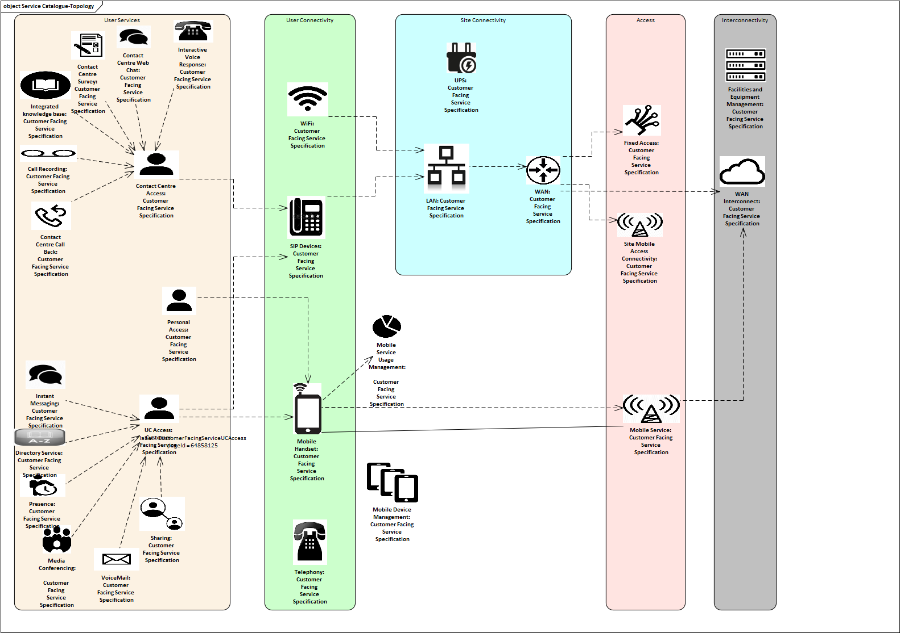
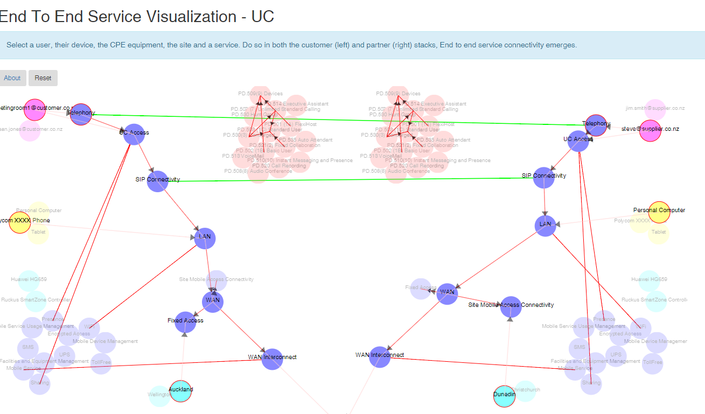
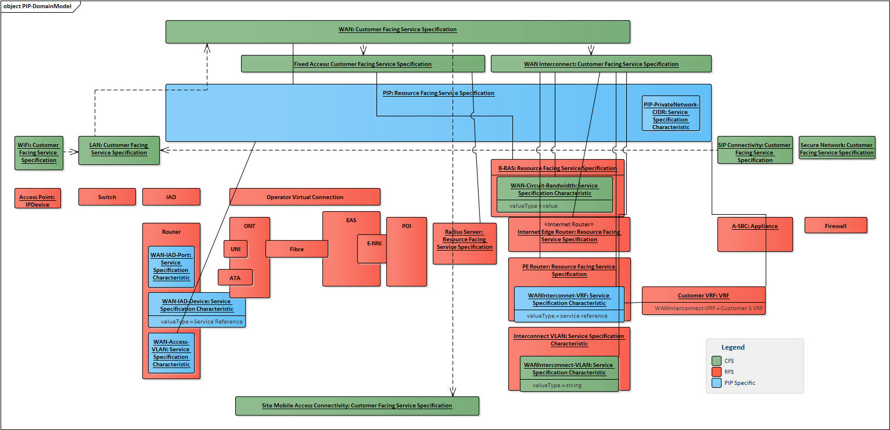
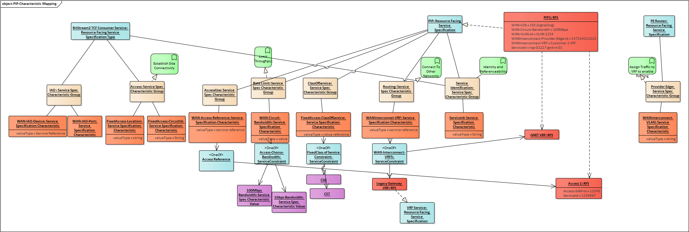

# Example

##  Customer Facing Service Specifications Topology

The following customer facing services have been identified to inform the customer of services which are provided to them through products.

When services are instantiated a chain service dependencies are formed.

## Private IP

A PIP service is virtual private connection from a customer site to an interconnect on the  Vodafone core network.

The following is a diagram relates

The PIP is defined by a collection of characteristics. Some map to services, some are specific to the PIP itself.  Likewise the access and provider edge router are defined similarly.

