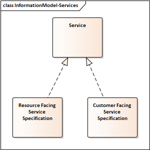
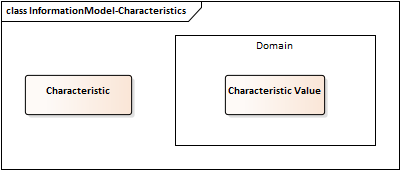
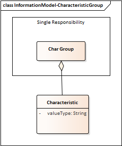
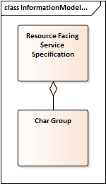
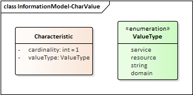
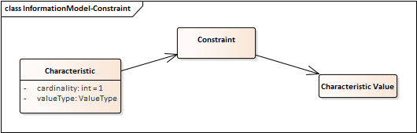
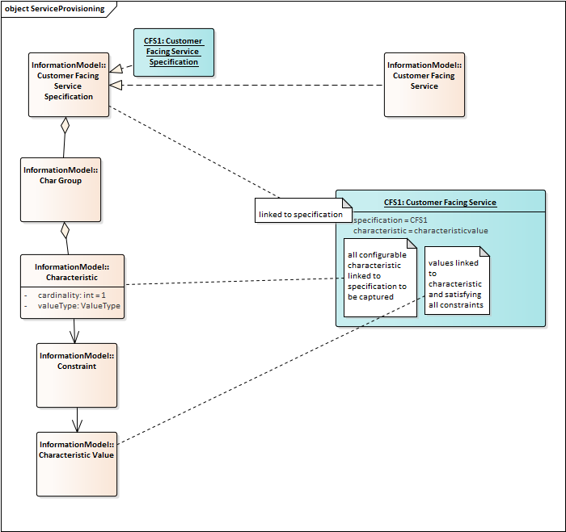
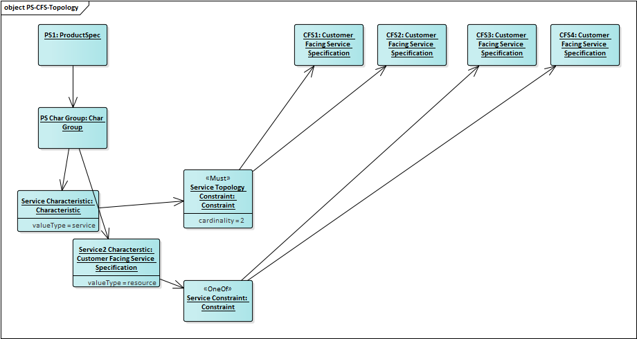
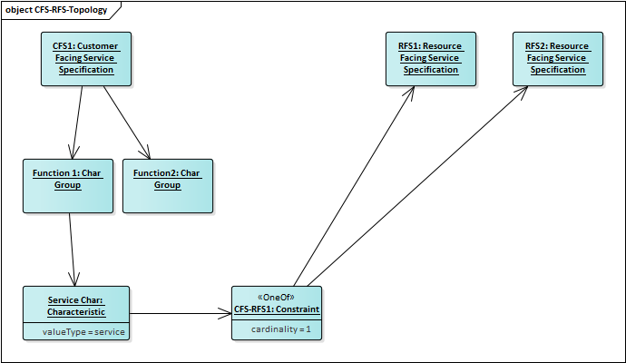

# Solution Catalogue Data

Available solutions are defined through a catalogue of services.

## Services

Services are cateogorized as resource facing or customer facing. Services are defined through a service specification.

The intention is that services are defined at the resource or technical layer but what are exposed to customers are the customer facing services.

## Characteristics

A characteristic is the name for a selection from a domain of values which are required to configure a service specification such that it can be realized as an instance.

## Characteristic Groups

Characteristics are placed into Groups related to functions of single responsibility. They can be in more than one characteritic group.

## Service Specification Characteristics

A service specification is associated to any number of characteristic groups and its defined by the union of all characteristics in the groups associated to it.

## Characteristic Values

Characteristic Values are members of the domain of values which can be used to configure the behavior of the service.

## Characteristic value types

As services are instantiated the values associated to Characteristics are captured.

The values can be:

- references to Characteristic Values
- references to Services
- reference to resources
- free text values

## Valid Characteristic Values

Constraints can constrain the Characteristic Values which are valid for services

## Service Provisioning

Provisioned Services require values for all characteristics associated to all characteristic groups associated to the service.

- Some characteristic (values) are defined as Product Specification constraints identified at product development time.
- Some characteristic (values) are identified at order time by information gathered from the customer.
- Other characteristics are identified at provision time by information gathered from suppliers or by reference to service inventory.

## Service Decomposition

Instantiating a Product involves identifying the Customer Facing services topology identified through characteristics identified on the Product Spec.
These constraints can declare prequisite,one-of,must-have, consistency and cardinality relationships from Product Spec characteristics to Customer Facing Service Specifications to define a product level topology.

Note that the constraints at the product should not duplicate service level topology but rather only the product level rules.

The Customer Facing Services also relate to RFS in the same manner.

